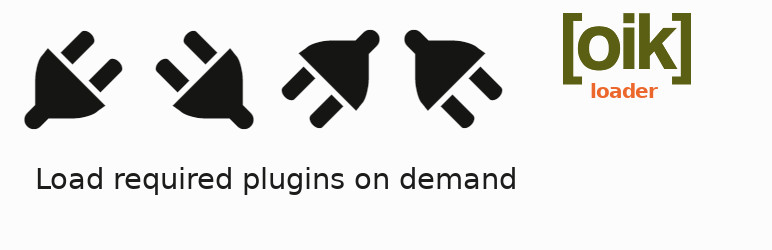

# oik-loader 

* Contributors: bobbingwide, vsgloik
* Donate link: https://www.oik-plugins.com/oik/oik-donate/
* Tags: oik, plugin, loader
* Requires at least: 5.2.3
* Tested up to: 5.9
* Stable tag: 1.3.1

WordPress Must Use plugin to load required plugins.

## Description 
Use the oik-loader plugin to load required plugins on demand.
Dynamically loading the required plugins allow the block catalog to show live examples of blocks implemented by a wide range of plugins.
Developed for use on blocks.wp-a2z.org and oik-plugins.com

## Installation 
1. Upload the contents of the oik-loader plugin to the `/wp-content/plugins/oik-loader' directory
1. Activate the oik-loader plugin through the 'Plugins' menu in WordPress
1. Visit oik-loader admin page
1. Click on the link to activate/update the Must Use ( MU ) plugin
1. Click on the link to Rebuild the index - oik-loader.site.csv file in the mu-plugins folder
1. Click on the link to Rebuild the plugin dependencies - oik-component-dependencies.site.csv file in the mu-plugins folder
1. If required provide an oik-loader-extras.csv file in the mu-plugins folder

* Note: In a WordPress Multi Site installation
- There will only be one version of the Must Use plugin ( oik-loader-mu.php )
- There will be multiple index and component dependencies files; one of each per site.
- There may be one oik-loader-extras.csv file.

## Frequently Asked Questions 

# What is this plugin for? 
It helps to reduce the number of activated plugins in blocks.wp-a2z.org
It dynamically loads the required plugins for a plugin, block or block_example.

# Which plugins can I deactivate? 
Once all the blocks for a plugin have been generated then the plugin can be deactivated.

With the following exceptions:
- oik-blocks - since these blocks are used in all content
- any other plugins that deliver blocks that are used throughout the site
- plugins which are required for other functionality

If not running an FSE the site should operate with/without Gutenberg being activated.
Currently Gutenberg is required for an FSE theme.
In v1.1.0 the logic has been changed to support different variants of the Gutenberg plugin being the activated plugin.

## Screenshots 
1. None

## Upgrade Notice 
# 1.3.1 
Update to stop NextGEN Gallery updating active_plugins.

# 1.3.0 
Upgrade for use on cwiccer.com

# 1.2.0 
Upgrade for fixes to issues #6 and #12

# 1.1.0 
Upgrade for a fix to issue #11 allowing a variation of the Gutenberg plugin to be activated.

# 1.0.0 
Upgrade for improved support for custom taxonomies and endpoints registered by plugins, through use of the oik-loader-extras.csv file.

# 0.1.1 
Fixes a couple of deployment problems.

# 0.1.0
Now supports plugin dependencies for blocks and block examples.

# 0.0.0 
Prototype version developed with oik-magnetic-poetry.
oik-blocks needs to be activated since these blocks are used by the block CPT.

## Changelog 
# 1.3.1 
* Changed: Prevent NextGEN Gallery from updating active_plugins at shutdown #13

# 1.3.0 
* Changed: Add support to edit the oik-loader-extras.csv file #13
* Fixed: Avoid notice when oik-loader-extras.csv file is missing #9
* Tested: With WordPress 5.9
* Tested: With PHP 8.0

# 1.2.0 
* Fixed: Avoid Warning for querystrings which represent arrays. Fixes #12
* Fixed: Load dependent plugins earlier #6
* Tested: With WordPress 5.9-RC3 and WordPress Multi Site
* Tested: With Gutenberg 12.3.2
* Tested: With PHP 8.0

# 1.1.0 
* Fixed: Avoid attempting to load different variants of Gutenberg,https://github.com/bobbingwide/oik-loader/issues/#11
* Tested: With WordPress 5.7.2 and WordPress Multi Site
* Tested: With Gutenberg 10.6.2 and different variations
* Tested: With PHP 8.0

# 1.0.0 
* Fixed: edd-api=products query parameter needs Easy-Digital-Downloads to be loaded,https://github.com/bobbingwide/oik-loader/issues/#7
* Fixed: 404's for unregistered taxonomies stopping blocks from working,https://github.com/bobbingwide/oik-loader/issues/#8
* Tested: With WordPress 5.2.3
* Tested: With Gutenberg 6.5.0
* Tested: With PHP 7.3

# 0.1.1 
* Fixed: Disable MU logic when running in batch
* Fixed: Avoid message from missing function when oik-loader-mu has not yet been deployed
* Tested: With WordPress 5.1.1 and WordPress Multi Site
* Tested: With Gutenberg 5.3
* Tested: With PHP 7.2

# 0.1.0 
* Added: Plugin dependency logic to dynamically load required plugins for a block / block example, https://github.com/bobbingwide/oik-loader/issues/#2
* Added: oik-loader admin to activate/deactivate the Must Use plugin ( oik-loader-mu.php )
* Added: oik-loader admin to build the index for oik-plugins, blocks and block examples
* Added: oik-loader admin to build the plugin dependency file
* Added: oik-loader admin to summarise oik-plugins
* Added: Support for editor invocation ( using post ), server side rendering ( using post_id ), and preview ( using preview_id )
* Added: Support for WordPress Multi Site

# 0.0.0 
* Added: oik-loader.php - the main plugin file
* Added: includes/oik-loader-mu.php to automatically load the required plugin
* Added: includes/oik-loader-map.php - to generate the oik-loader.csv file

## Further reading 
If you want to read more about oik plugins and themes then please visit
[oik-plugins](https://www.oik-plugins.com/)

